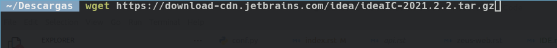
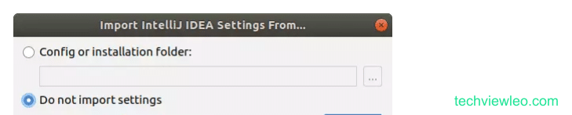
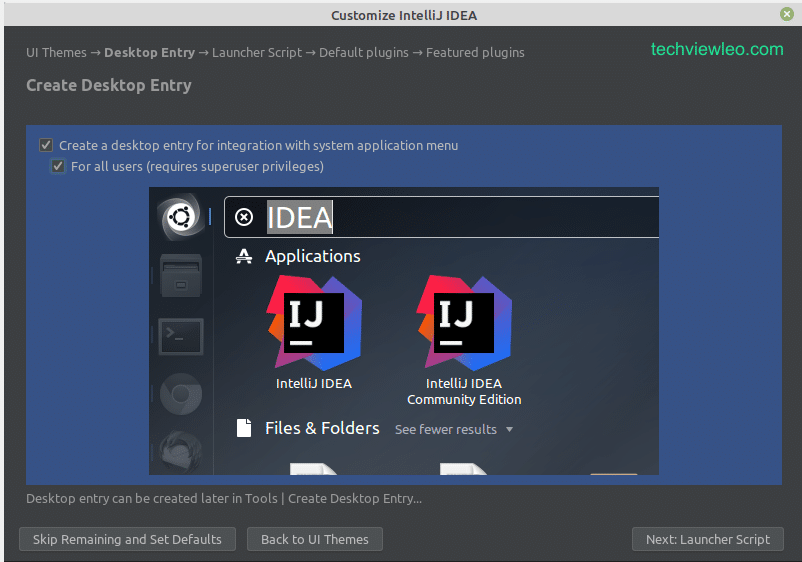

Instalación IntelliJIdea
=========================

Para comenzar con la instalación de IntelliJIDEA abrimos una consola:
    - Vamos a la carpeta de descargas

.. code-block:: console
    $ cd Descargas

Si no tenemos instalada la herramienta wget la instalamos con el siguiente comando:

.. code-block:: console
    $ sudo apt install wget

Luego escribimos el siguiente comando para descargar el archivo de instalación de IntelliJIDEA:

.. code-block:: console
    $ wget https://download-cdn.jetbrains.com/idea/ideaIC-2021.2.2.tar.gz

Seguido del siguiente comando para descoprimir el archivo descargado:

.. code-block:: console
    $ tar xvf ideaIC-2021.2.2.tar.gz

.. image:: ../img/descomprimirDescargar.png

Despues de completado este proceso movemos la carpeta obtenida a:

.. code-block:: console
    $ sudo mv idea-IC-212.5284.40 /opt/idea

Luego lo ejecutamos con:

.. code-block:: console
    $ /opt/idea/bin/idea.sh

Dado que se trata de una nueva instalación, no vamos a importar ninguna configuracion.

Acepte crear un acceso directo en el escritorio

