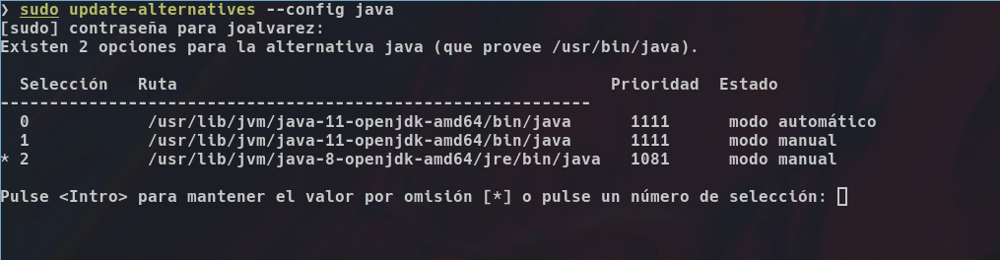
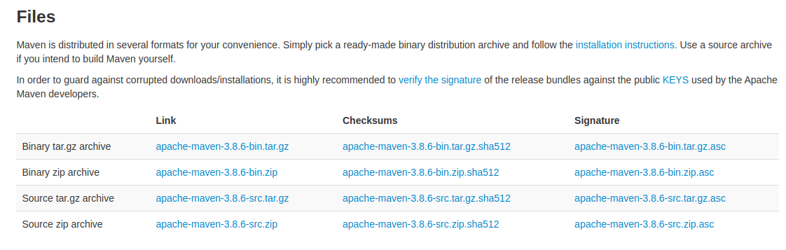
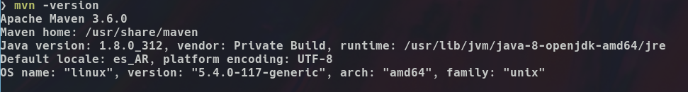
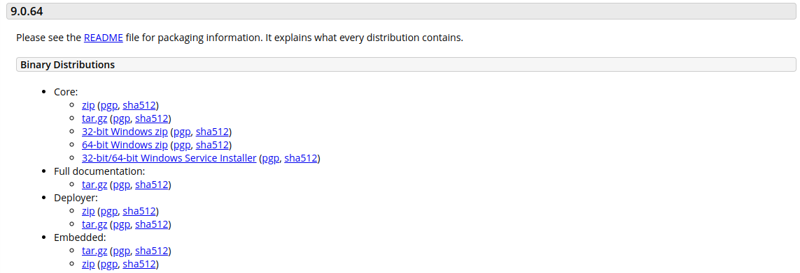

Zeus-Web
===============

Tener en cuenta que enseñaremos a levantar el proyecto en el sistema operativo Linux, que es el que proporciona la empresa. Aunque la empresa brinde soporte para el IDE eclipse la mayoria usamos IntelliJIdea por lo que los ejemplos siempre estaran hechos con ese IDE.

Requerimientos
---------------

Para correr proyecto necesitamos:
    - Java versión 8
    - Maven version 3.6.0 como minimo.
    - IDE IntelliJIdea

Java
---------------

Instalaremos la versión de Java 8 mediante la consola.

.. code-block:: console
    $ sudo apt install openjdk-8-jdk openjdk-8-jre

La ubicación por defecto de la instalación es **/usr/lib/jvm**. Para comenzar a usar esta versión ingresaremos en la consola el siguiente comando.

.. code-block:: console
    $ sudo update-alternatives --config java

Elegimos la opción de java 8 y con esto terminamos la instalación de java.

Maven
---------------

Lo más correcto seria tener una carpeta personal para ubicar todos los programas que vallamos necesitando y/o utilizando para mantener un orden y saber donde estan ubicados ya que más adelante necesitaremos saber donde se encuentren por cambios de versión o configuración que vamos a ver mas adelante.

**Ej: /home/mint19/carpetaPersonal/programas/maven**

Por medio de la consola:
.. code-block:: console
    $ cd ~/carpetaPersonal/programas/maven

O por medio de interfaz, lo que mas te guste.

Luego ingresamos a este link,

`Maven <https://maven.apache.org/download.cgi>`

y buscamos el apartado **Files**

de la primera columna clickeamos en la primera fila, se descargara un archivo comprimido, si nos dirigimos **/home/mint19/Descargas** encontraremos el archivo, click derecho extraer aqui y lo movemos a la carpeta que creamos para maven.

Una vez terminado esto debemos agregar al archivo .bashrc que se encuentra por lo general en **/home/mint19/.bashrc**. Esta ruta 

**export PATH=/home/mint19/carpetaPersonal/programas/maven/apache-maven-x.x.x/bin:$PATH**

Por lo general la agregamos al final del archivo. Abrimos una consola y escribimos:

.. code-block:: console
    $ nano .bashrc

Agregamos la linea guardamos con **Ctrl + o** , **ENTER** para confirmar y **Ctrl + x** para salir.

.. code-block:: console
    $ source .bashrc

Con este comando actualizamos los cambios realizados en el archivo de configuración .bashrc, luego escribimos:

.. code-block:: console
    $ mvn -version

Si hicimos todo correctamente nos mostrara la versión de maven instalada de la siguiente manera:

Tomcat
---------------

Ingresaremos a este link para descargar la versión 9.

`Tomcat <https://tomcat.apache.org/download-90.cgi>`

Damos click en el segundo link tar.gz(pgp, sha512)
    - Nos dirigimos a la carpeta donde descargamos el archivo.
    - Damos click derecho sobre el archivo y seleccionamos **extraer aquí**
    - Creamos una nueva carpeta en nuestra ruta para programas 
    **/home/mint19/carpetaPersonal/programas/Tomcat**
    - Cortamos la carpeta y la movemos a nuestra carpeta personal creada 

Una vez terminado esto debemos agregar al archivo .bashrc que se encuentra por lo general en **/home/mint19/.bashrc**. Esta ruta 

**export PATH=/home/mint19/carpetaPersonal/programas/Tomcat/apache-tomcat-x.x.xx/bin:$PATH**

Para ingresar a este archivo ingresamos a una terminal y escribimos,

.. code-block:: console
    $ nano .bashrc

Agregamos al final del archivo esta linea y guardamos los cambios.

.. code-block:: console
    $ source .bashrc

Con esto actualizamos los cambios hechos en el archivo .bashrc .

Para verificar que realizamos todo este procedimiento lo correctamente. Nos dirigimos a la carpeta donde tenemos tomcat, entramos a la carpeta bin:
    - Doble click en el archivo **startup.sh**
    - Vamos al navegador e ingresamos la ruta http://localhost:8080
    - Si es correcto nos mostrara la pagina de apache-tomcat
    - Luego damos doble click en el archivo **shutdown.sh**, para parar el servidor.

